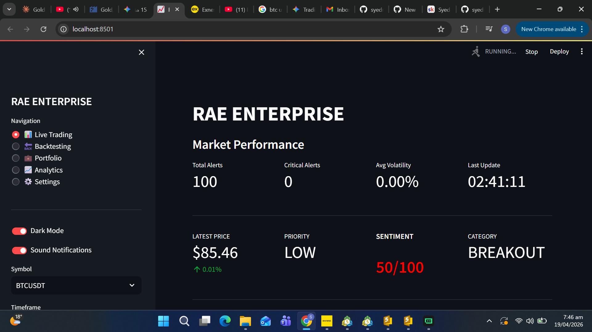
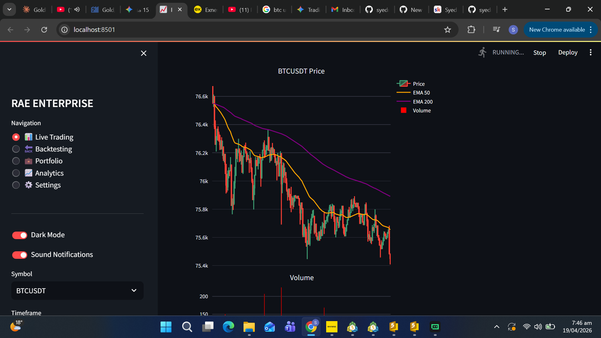

# RAE ENTERPRISE: Agentic AI Trading Suite

RAE ENTERPRISE is a real-time crypto monitoring and alerting suite that bridges live market micro-events (WebSocket trade ticks) with LLM-driven sentiment and trade guidance. It is built for low-latency streaming, explainable alerts, and an operator-friendly Streamlit dashboard.

### What You Get

- Real-time market ingestion from Binance WebSocket streams
- Stateful stream processing (buffers, indicators, throttling, alert categories)
- Optional AI enrichment (Gemini / OpenRouter / Claude) returning a Sentiment Score and structured JSON
- Multi-channel alert delivery (console, Gmail SMTP, Slack, Discord, Telegram, Twilio)
- Streamlit dashboard for live monitoring, analytics, and portfolio utilities

---

## Screenshots





## System Architecture

This repo (RAE-ENTERPRISE) connects three layers:

1) **Real-time financial data**
- Binance trade ticks arrive via WebSocket and are normalized into a consistent tick schema.
- Source: [data_sources.py](src/data_sources.py)

2) **Stream intelligence (signals + alert decisions)**
- Ticks are aggregated into rolling OHLCV buffers per symbol.
- Technical indicators and pattern heuristics are computed.
- Alerts are categorized and throttled to avoid noise.
- Engine: [stream_engine.py](src/stream_engine.py) and [indicators.py](src/indicators.py)

3) **LLM-driven sentiment analysis**
- When enabled, the alert payload is enriched by an LLM that returns structured JSON, including `sentiment_score`.
- Analyzer: [ai_analyzer.py](src/ai_analyzer.py)

Alert delivery + persistence:
- Alerts are written to `logs/alerts.json` (root-relative) and optionally broadcast to messaging channels.
- Broadcaster: [alerts.py](src/alerts.py)

Dashboard UI:
- Streamlit reads `logs/alerts.json` and renders charts and pages.
- UI: [dashboard.py](src/dashboard.py)

High-level flow:

```
Binance WebSocket (trade ticks)
        |
        v
BinanceWebSocket.stream()  -> normalized ticks
        |
        v
EnterpriseStreamEngine.process_tick()
  - buffers + indicators + patterns
  - categorize + throttle
        |
        v
Alert payload (JSON)
  + optional EnterpriseAIAnalyzer.analyze_alert() -> sentiment_score
        |
        v
AlertManager.broadcast()
  - writes logs/alerts.json
  - sends Gmail/Slack/Discord/Telegram/Twilio
        |
        v
Streamlit dashboard reads logs/alerts.json and renders UI
```

---

## Tech Stack

- Python 3.10+
- Streamlit
- Binance API (WebSocket + REST via python-binance)
- Google Gemini AI (optional) + OpenRouter/Anthropic (optional)
- Asyncio + aiohttp

---

## Quickstart

### 1) Install

```bash
python -m venv .venv
source .venv/bin/activate   # Windows: .venv\Scripts\activate
python -m pip install -r requirements.txt
```

### 2) Configure

Copy `.env.example` to `.env` and fill in the values you want:

```bash
cp .env.example .env
```

Gmail SMTP note: use a Google App Password (not your normal Gmail password).

### 3) Run (UI-only)

```bash
streamlit run src/dashboard.py --server.address localhost --server.port 8501
```

Open: http://localhost:8501

### 4) Run (Full system: backend + UI)

Terminal 1:

```bash
python main.py --ai-mode false
```

Terminal 2:

```bash
streamlit run src/dashboard.py --server.address localhost --server.port 8501
```

---

## Environment Variables

See `.env.example` for the full list. Key variables:

- `SYMBOLS` (comma-separated): `btcusdt,ethusdt,solusdt`
- `ALERT_THRESHOLD_PERCENT`: alert trigger threshold
- `BINANCE_WS_URL`: base websocket URL
- `GEMINI_API_KEY`, `GEMINI_MODEL`: Gemini configuration
- `OPENROUTER_API_KEY`, `DEFAULT_AI_MODEL`: OpenRouter configuration
- `SMTP_USERNAME`, `SMTP_PASSWORD`, `ALERT_EMAIL`: Gmail SMTP alerts

---

## Security

- Do not commit `.env` to source control.
- Rotate keys immediately if you suspect exposure.
